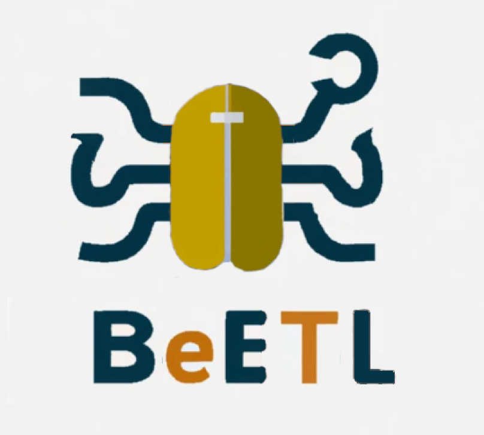

<h1 style="width: 100%; text-align: center; margin-bottom: 20px; border-bottom: 0px;">BeETL: Extensible Python/Polars-based ETL Framework</h1>
<p style="text-align: center; margin-bottom: 30px;"><br/></p>
BeETL was born from a job as Integration Developer where a majority of the integrations we develop follow the same pattern - get here, transform a little, put there (with the middle step frequently missing altogether). 

After building our 16th integration between the same two systems with another manual template, we decided to build BeETL. BeETL is currently limited to one datasource per source and destination per sync, but this will be expanded in the future. One configuration can contain multiple syncs.

Note: Even though most of the configuration below is in YAML format, you can also use JSON or a python dictionary.

## Todo:
- [ ] Soft Delete/Hard Delete

## TOC
- [Installation](#installation)
  - [From PyPi](#from-pypi)
  - [From Source](#from-source)
- [Quick Start](#quick-start)
- [Documentation](https://beetl.readthedocs.io/en/latest/)
- [Source Code](https://github.com/hoglandets-it/beetl)

## Installation
### From PyPi
```bash
pip3 install beetl
```

### From Source
```bash
git clone https://
python3 setup.py install
```
