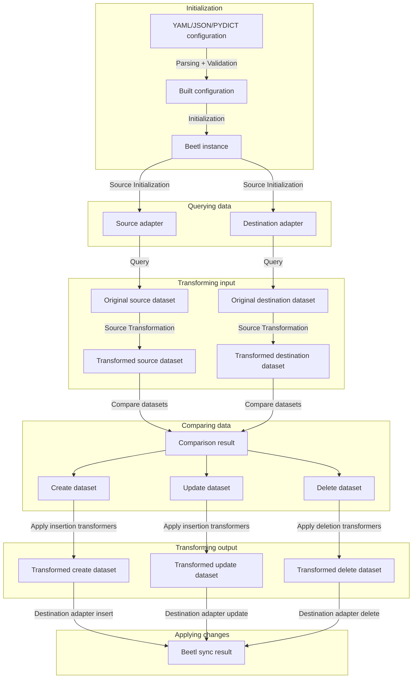

# Flow
## Diagram
Scroll down to see more in detail information about each step.

## Initialization
First beetl will instantiate a BeetlConfig from the YAML, JSON or Dictionary configuration that you provided. Beetl will detect the version specified in the configuration in order to be backwards compatible. In addition to this a sanity check will be performed to make sure mandatory properties are present.

After that the beetl instance will be initialized and the sources for your data created.

## Querying data
Beetl requests the original dataset from your source and destination.

For MongoDB database sources, columns with the type of ObjectId will be automatically converted to strings.

## Transforming input
Beetl will apply the source and destination transformers in the order that you declared in the configuration. The result is a transformed source and destination dataset that will be used for comparison.

## Comparing data
The goal of comparing the data is to provide a comparison result in the form of three new datasets.

1. Create: The rows that will be inserted at the destination.
   - These are the items present in source but not present in destination.
1. Update: The rows that will be updated in the destination.
   - These are the items present in both but with columns that differ in value.
1. Delete: The row that will be deleted from the destination.
   - These are the item present in destination but not in source.

Beetl will use the columns property of your source and destination configuration to identify unique rows across the datasets and compare their values.

The resuling datasets will have the schema of the transformed source dataset.

## Transforming output
Beetl will now apply the intertionTransformers to the Create and Update datasets, while applying the deletionTransformers to the Delete dataset.

## Applying changes
The changes are sent to the destination source insert, update and delete methods to be applied to the destination.

The Result object returned from the beetl.Sync method contains information about the insert, update and delete count.
